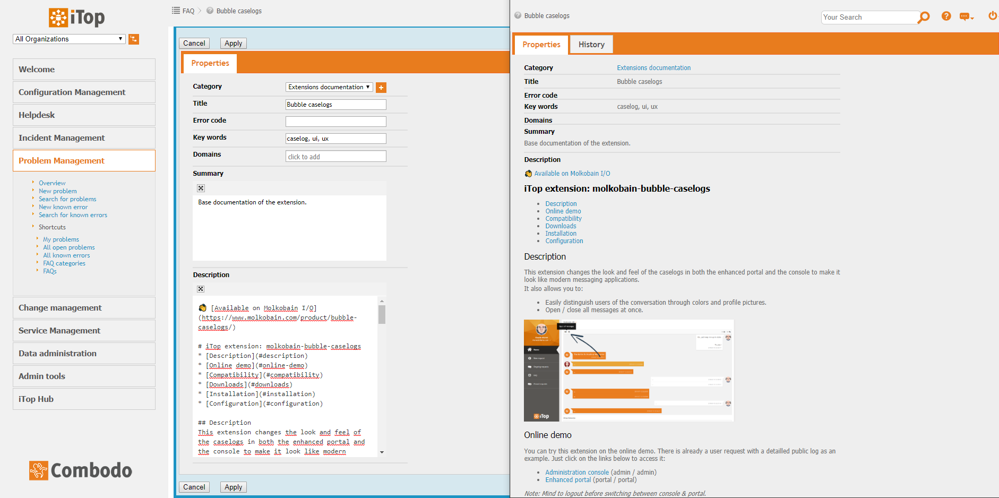
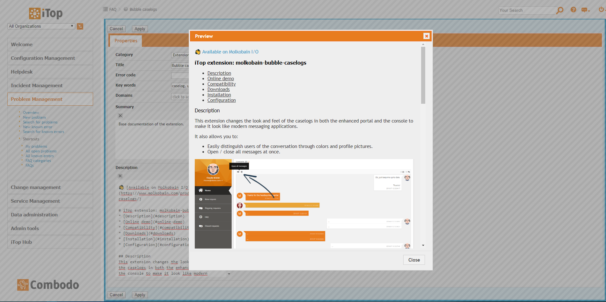
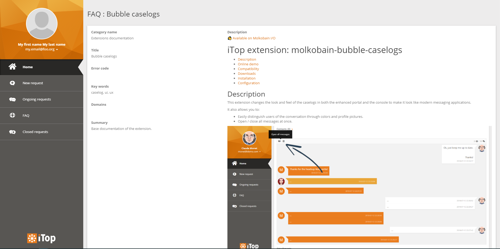
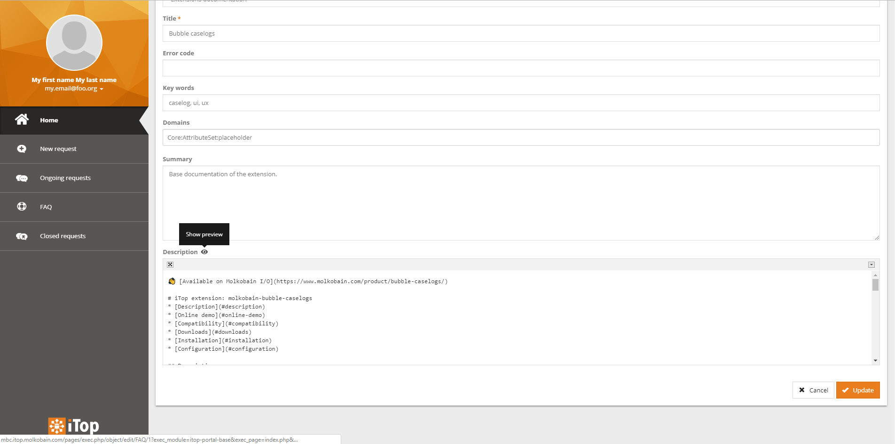
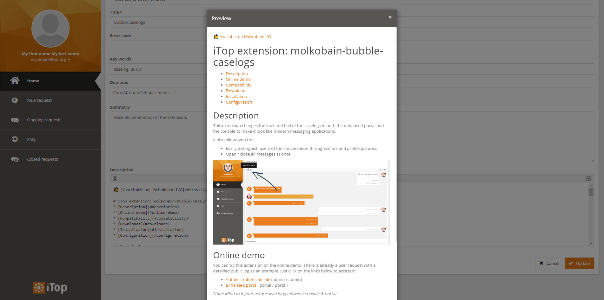
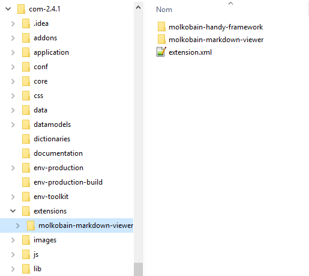

👋 [Available on Molkobain I/O](https://www.molkobain.com/product/markdown-viewer/)

# iTop extension: molkobain-markdown-viewer
* [Description](#description)
* [Online demo](#online-demo)
* [Compatibility](#compatibility)
* [Downloads](#downloads)
* [Installation](#installation)
* [Configuration](#configuration)
* [Change log](CHANGELOG.md)

## Description
Easily edit fields in Markdown without any modification to your datamodel!

Advanced features support such as headings, emphasis, lists, images, hyperlinks, highlighting, code formatting...



Instant preview of Markdown rendering while editing


Fully compatible with the enhanced portal...


... in both visualization and edition



## Online demo
You can try this extension on the online demo. There are already some FAQs with a markdown description as an example. Just click on the links below to access it:
* [Administration console](http://mbc.itop.molkobain.com/pages/UI.php?operation=details&class=FAQ&id=1&c[menu]=FAQ&auth_user=admin&auth_pwd=admin) (admin / admin)
* [Enhanced portal](http://mbc.itop.molkobain.com/pages/exec.php/object/view/FAQ/1?exec_module=itop-portal-base&exec_page=index.php&portal_id=itop-portal&auth_user=portal&auth_pwd=portal) (portal / portal)

*Note: Mind to logout before switching between console & portal.*

## Compatibility
Compatible with iTop 2.4+

## Dependencies
* Module `molkobain-handy-framework/1.1.1`
* Module `molkobain-newsroom-provider/1.0.0`

*Note: All dependencies are included in the `dist/` folder, so all you need to do is follow the installation section below.*

## Downloads
Stable releases can be found on [Molkobain I/O](https://www.molkobain.com/product/markdown-viewer/).

## Installation
* Unzip the extension
* Copy the ``molkobain-markdown-viewer`` folder under ``<PATH_TO_ITOP>/extensions`` folder of your iTop
* Run iTop setup & select extension *Markdown editor*

*Your folders should look like this*



## Configuration
Out of the box this extension doesn't change any attributes, you have to configure which attributes you want to be rendered as Markdown. To do so, take a look at the ``markdown_attributes`` parameter in the next section.

### Parameters
Some configuration parameters are available from the Configuration editor of the console:
* ``enabled`` Enable / disable the extension without having to uninstall it. Value can be ``true`` or ``false``.
* ``markdown_attributes`` Class attributes to enable as Markdown. Value must be an array of classes, each containing an array of the attributes you want to render as Markdown. Default value is none, you have to set which ones you want!

*Example:*
```
'molkobain-markdown-viewer' => array (
  'enabled' => true,
  'markdown_attributes' => array(
    'Service' => array('description'),
    'ServiceSubcategory' => array('description'),
    'FAQ' => array('summary', 'description'),
  ),
),
```

## Licensing
This extension is bound by the license you purchased. A license grants you a non-exclusive and non-transferable right to use and incorporate the item in your personal or commercial projects. There are several [licenses available](https://www.molkobain.com/usage-licenses/).
